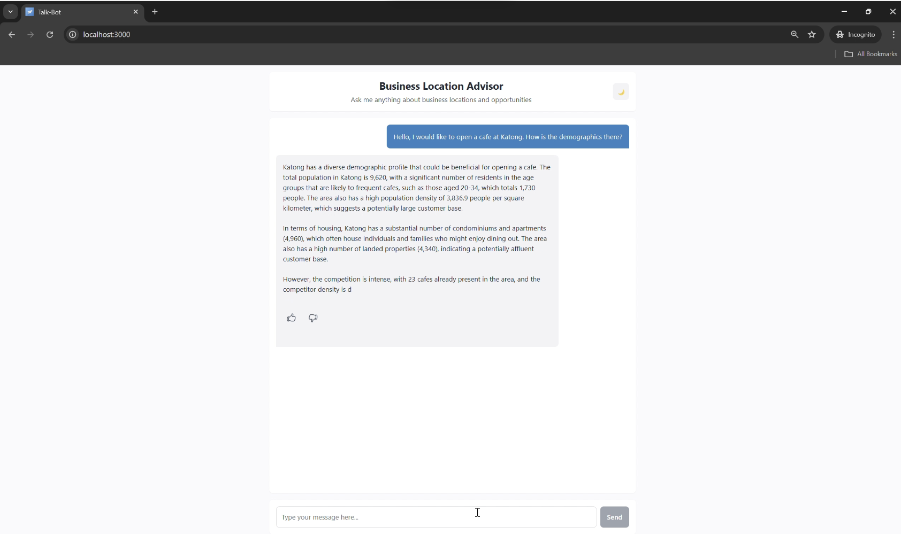
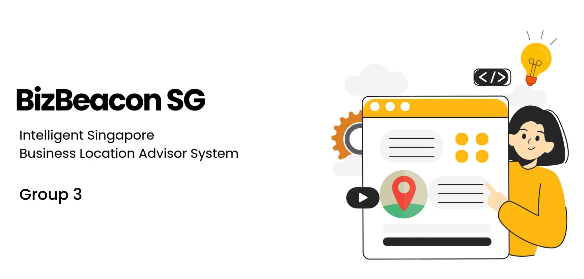

## SECTION 1 : PROJECT TITLE
### BizBeacon SG - An Intelligent Singapore Business Location Advisor



---

## SECTION 2 : EXECUTIVE SUMMARY
Choosing the right location and type for a business is a critical decision that impacts its success, influencing factors such as customer accessibility, brand visibility, and operational efficiency. However, many entrepreneurs and small businesses in Singapore face challenges in making informed decisions due to fragmented, time-consuming, and costly research methods. To address this, our team of 5 aim to develop an AI-driven business advisor tailored to the Singapore market that streamlines the decision-making process. Our tool offers a unified platform that not only suggests profitable business locations but also recommends viable business types and answers location-specific queries.

Our solution revolves around an intelligent chatbot integrated with retrieval-augmented generation (RAG), built upon a knowledge graph. The process begins with data collection and preparation, followed by the creation of the knowledge graph on Neo4j, which encodes the relationships between businesses, business types, Singapore’s planning areas or subzones, and their respective attributes. To extract valuable insights from this data, we integrate a scoring engine that involves geospatial density analysis, fuzzy logic, and graph neural networks (GNNs). These techniques help compute scores that are eventually used to rank potential business locations based on factors like population density and competitor presence. 

When a user interacts with our chatbot, it extracts their intent and relevant entities from their input, and selects the most appropriate Cypher query or queries from a predefined list to retrieve the relevant data from the knowledge graph. This retrieved data is then incorporated into the user’s query to provide richer context, before being processed by a large language model (LLM), specifically OpenAI’s GPT-4o, to generate user-friendly answers and recommendations.

Our tool is specifically designed to help first-time business owners in Singapore make informed, data-driven decisions on where to establish their businesses or what type of business to start. By integrating geospatial data, competitor analysis, and demographic insights, our system enables entrepreneurs to confidently navigate the complexities of starting a business.

---

## SECTION 3 : CREDITS / PROJECT CONTRIBUTION

| Full Name  | Student ID  | Work Items  | Email  |
| ------------ | ------------ | ------------ | -------- |
| Chua Hieng Weih | A0315386Y | 1. System architecture design<br/> 2. Knowledge graph development<br/> 3. Fuzzy logic + GNN development<br/> 4. System testing<br/> 5. Project proposal and report writing<br/> 6. Technical video scripts and slides | e1509825@u.nus.edu |
| Gu Haixiang | A0131920U | 1. Data research, acquisition, and processing<br/> 2. RAG development<br/> 3. System testings and evaluations<br/> 4. Project proposal and report writing<br/> 5. Technical video scripts and slides | e1509623@u.nus.edu |
| Lizabeth Annabel Tukiman | A0315378X | 1. Knowledge graph queries development<br/> 2. RAG development<br/> 3. System testing<br/> 4. Project proposal and report writing<br/> 5. Technical video voiceover recording and use case scripts and slides | e1509817@u.nus.edu |
| Sritam Patnaik | A0115530W | 1. User interface development<br/> 2. ⁠Flask server and API development<br/> 3. ⁠RAG development<br/> 4. ⁠Prompt engineering<br/> 5. Project report writing<br/> 6. Technical video use case slides| e1513592@u.nus.edu |
| Muhammad Harun bin Abdul Rashid | A0164598L | 1. Data acquisition and processing<br/> 2. Database and knowledge graph development<br/> 3. Geospatial density analysis<br/> 4. Project proposal and report writing<br/> 5. Marketing video creation| e0148640@u.nus.edu |

---

## SECTION 4 : VIDEO OF SYSTEM MODELLING & USE CASE DEMO

[](Video/IRS-PM-2025-01-11-IS07PT-GRP3-BizBeaconSG-system.mp4 "System Video")

---

## SECTION 5 : USER GUIDE

Click [here](ProjectReport/IRS-PM-2025-01-11-IS07PT-GRP3-BizBeaconSG-Installation-and-User-Guide.pdf "Installation and User Guide") for the installation and user guide.

The installation and user guide is also included as Appendix C in the project report [here](ProjectReport/IRS-PM-2025-01-11-IS07PT-GRP3-BizBeaconSG-Group-Report.pdf "Project Report").

### Installation Guide
#### Supabase Setup

To store relational data in Supabase and access links to property listings:

1. Sign in or create a Supabase account at [https://supabase.com/dashboard/sign-in](https://supabase.com/dashboard/sign-in).

2. Create a new project in Supabase and head to the SQL Editor, which can be found on the leftside menu.

3. Run the following query to enable the PostGIS extension:

   ```sql
   CREATE EXTENSION IF NOT EXISTS postgis;
   ```

4. Navigate to the backend supabase_setup directory, which contains ```table_creations``` and ```data``` folders:

   ```bash
   cd SystemCode/backend/supabase_setup
   ```

4. Run every script in the ```table_creations``` folder in ascending order based on the prefixed number in their filenames, by copying and pasting the queries in each file and running them in Supabase's SQL Editor.

5. Head to Supabase's Table Editor, also found on the leftside menu.

6. For each table, click on the green "Insert" button near the top, select "Import data from CSV", upload its corresponding csv file found in the ```data``` folder, and click "Import data".

7. Our Supabase database is set up. Note the database credentials, namely the project URL and API key, that can be found from the "Data API" tab in "Project Settings" on the leftside menu. 

#### Neo4j Setup

To use our constructed knowledge graph:

1. Sign in or create a Neo4j Aura account at [https://console-preview.neo4j.io/](https://console-preview.neo4j.io/).

2. Once logged in, create a new instance or use an existing instance. Note the instance details, namely ```NEO4J_URI```, ```NEO4J_USERNAME```, and ```NEO4J_PASSWORD```.

3. Click the 3 dots by the instance and click "Snapshots".

4. Head to the "Restore from backup file" tab and upload the ```neo4j_snapshot.backup``` file in the ```SystemCode/backend/neo4j_setup``` folder.

5. Once imported, the knowledge graph is ready to be viewed and queried. Click on "Connect" at the right side of the instance and then "Query" to connect to the uploaded knowledge graph snapshot.

#### Backend Setup

The backend is a Python Flask server that interfaces with OpenAI's API. To set it up:

1. Navigate to the backend server directory:

   ```bash
   cd SystemCode/backend/server
   ```

2. Create and activate a virtual environment:

   ```bash
   python -m venv venv
   source venv/bin/activate  # On Windows: venv\Scripts\activate
   ```

3. Install dependencies:

   ```bash
   pip install -r requirements.txt
   ```

4. Create a `.env` file with your OpenAI API key and Neo4j and Supabase credentials:

   ```bash
   OPENAI_API_KEY=your_openai_api_key_here

   # Neo4j credentials
   NEO4J_URI=neo4j+s:<your_neo4j_uri_here>
   NEO4J_USERNAME=neo4j
   NEO4J_PASSWORD=<your_neo4j_pwd_here>

   # Supabase credentials
   SUPABASE_URL=<your_supabase_url_here>
   SUPABASE_KEY=<your_supabase_key_here>
   ```

5. Start the server:
   ```bash
   python app.py
   ```
   The server will run at [http://localhost:4000](http://localhost:4000) by default.

#### Frontend Setup

The frontend is built with Create React App. To get started:

1. Navigate to the frontend directory:

   ```bash
   cd SystemCode/frontend
   ```

2. Install dependencies:

   ```bash
   npm install
   ```

3. Start the development server:
   ```bash
   npm start
   ```
   The app will be available at [http://localhost:3000](http://localhost:3000).

4. Our chatbot supports the following query types:
   - general advice given a business type and planning area / subzone
      - e.g., “I would like to open a cafe at Katong. What do you think about it?”
   - location suggestion given a business type
      - e.g., “Where should I open a cafe in Singapore?”
   - business type suggestion given a planning area / subzone
      - e.g., “What type of business would you recommend me to start in Katong?”
   - demographics information, such as population statistics, age distribution, and housing profile, in a given planning area / subzone
      - e.g., “How is the demographics in Katong?”
      - e.g., “Tell me more about Katong’s age distribution.”
   - competitor information, such as overall score, underserved score, and competitor examples, for a given business type and/or planning area / subzone
      - e.g., “How is the competition for cafes like in Katong?”
      - e.g., “How is the overall competition like in Katong?”
      - e.g., “How is the competition for cafes like across the whole of Singapore?”
      - e.g., “I would like to open a cafe at Katong. Who are some competitors?”
   - properties information, including average property prices for different venue types for both rent and sale, and available properties in a given planning area / subzone
      - e.g., “What is the average property prices for retail shops in Katong?”
      - e.g., “What are some properties I can consider if I want to open a cafe at Katong?”

   Happy chatting!

---

## SECTION 6 : PROJECT REPORT / PAPER

Click [here](ProjectReport/IRS-PM-2025-01-11-IS07PT-GRP3-BizBeaconSG-Group-Report.pdf "Project Report") for the project report.

The report contains the following sections:<br/>
- Executive Summary
- Introduction
- Project Solution
- Project Implementation
- Project Performance and Validation
- Conclusion
- Appendix A: Project Proposal
- Appendix B: Mapped System Functionalities Against Courses
- Appendix C: Installation and User Guide
- Appendix D: References
- Appendix E: Individual Reports

and other subsections.

---

## SECTION 7 : MISCELLANEOUS
The [Miscellaneous](Miscellaneous "Miscellaneous") folder contains images / thumbnails used in this README.md file.

---
